### CS424: Visualization and Visual Analytics

#### Table of Contents
1. [General Information](#general-information)
    1. [Class Meeting Information](#class-meeting-information)
    2. [Course Instructor](#course-instructor)
2. [Course Description](#course-description)
    1. [Rationale](#rationale)
    2. [Course Pre-requisites](#course-pre-requisites)
    3. [Objectives](#objectives)
    4. [Textbooks and Readings](#textbooks)
    5. [Deliverables](#deliverables)
    6. [Format and Teaching Methods](#format-and-teaching-methods)
3. [Course Schedule](#course-schedule)
4. [Evaluation and Grading](#evaluation-and-grading)
    1. [Grading Policy](#grading-policy)
    2. [Evaluation Schedule](#evaluation-schedule)
    3. [Assignment Considerations](#assignment-considerations)
    4. [Late Days](#late-days)
5. [Final Project Gallery](#final-project-gallery)
6. [Acknowledgments](#acknowledgements)
7. [Academic Integrity](#academic-integrity)
8. [Inclusive Learning Environment](#inclusive-learning-environment)
9. [Disability Accommodation Procedures](#disability-accomodation-procedures)
10. [Disclaimer](#disclaimer)

### General Information

#### Class Meeting Information
We will meet in-person in EVL's [Continuum room](https://www.evl.uic.edu/location), at the time indicated in the schedule of classes. Please read the [evaluation](#evaluation-and-grading) section for details on attendance. Office hours will be held via Zoom.

Discord will be the main platform for instructor / student communication, please check Blackboard for the Discord invitation link. Zoom meeting information will be posted on Discord.

#### Course Instructor
Fabio Miranda

fabiom [at] uic.edu

https://fmiranda.me/

Office hours: Friday 11am - 1pm (Zoom info on Piazza).

#### Teaching Assistant

Kazi Omar

komar3 [at] uic.edu

Office hours: Friday 9am - 11am (Zoom info on Pizza).

***

### Course Description

This course provides an introduction to the field of visualization, including scientific visualization, information visualization, visual analytics, and the effective use of interactive visualization for analytical reasoning. The course is designed to balance theory and practice, covering both design and implementation aspects of visual analytics systems. Topics include: basic principles of data visualization; exploratory data analysis; data management for visualization; embedded, juxtaposed and coordinated views; visual analytics systems; machine learning for visualization; spatial and uncertainty visualization; techniques for big data visualization. The course will also include an introduction to data analysis libraries and frameworks, and web technologies for visualization.

Course website: https://fmiranda.me/courses/cs424-fall-2022/

#### Rationale
In the past decade, technological innovations have enabled the automatic collection of a diverse set of very large datasets, from user-generated content, such as tweets, to sensor data, such as noise decibel level or aerial surveys. The ability to understand, process, extract value from, and visualize it, is going to be hugely important in the next decades. Well-designed data visual analytics systems merge domain expertise and analytics techniques, enabling users to gain insights into real-world problems by formulating and testing hypotheses, and to address domain-specific challenges. This course will introduce students to visualization and visual analytics, covering the fundamentals of visualization and visual analytics, exploratory data analysis, data management and machine learning techniques for visualization, and the technological frameworks needed to create visual analytics systems.

#### Course Pre-requisites

CS 251 (Data Structures) and solid grasp of programming in a language like C, C++, Java, Python or JavaScript and basic data structures to be able to implement the visualization projects in the course.

#### Objectives

By the end of the course, students will have a good understanding of the basic principles of visualization and visual analytics and will be able to articulate advantages and disadvantages of visual design choices for different data types. They will also be able to design and implement web-based visual analytics systems by combining visualization, data management, data mining and machine learning techniques that work in tandem to enable interactive exploration of multidimensional and heterogeneous datasets.

#### Textbook

- Visualization Analysis and Design, AK Peters (Optional)

#### Deliverables

Students will be required to complete three projects, where they will implement concepts and techniques covered in class using real-world datasets. Students will need to present their projects to the class, so it is very important that they are finished by the deadlines. The first project will cover exploratory data analysis using interactive computing frameworks (e.g., Jupyter); the second project will cover coordinated views using collaborative environments (e.g., Observable); the third project will cover spatial data visualization using web technologies (e.g., Javascript, React). Project repositories should also contain a ~500 word markdown report, giving an overview of the dataset, approach and detailing findings. On top of that, students will also need to select one visualization (from a well-known source), and critically evaluate it, presenting their conclusions through a class presentation.

#### Format and Teaching Methods

The course is divided into three parts: 1) basic principles of visualization and exploratory data analysis; 2) coordinated views and visual analytics; 3) spatial and uncertainty visualization, and data mining and machine learning techniques. In each part, students will be introduced to the related theory as well as different tech stacks needed to create visual analytics solutions. The course will be driven by lectures and in-class discussion. Other relevant activities include three projects and two evaluations of visualizations.

***

### Course Schedule
This is a tentative course schedule and will be adjusted along the way. Slides will be made available after each lecture.

| Week |        | Topic                                     | Resources                             | Slides |
| ---- | ------ | ----------------------------------------- | -------------------------------------------------- | ------ |
| 1  | Aug 23 | Course introduction & Why vis? | | [01-intro.pdf](https://fmiranda.me/courses/cs424-slides/01-intro.pdf), [02-why-vis.pdf](https://fmiranda.me/courses/cs424-slides/02-why-vis.pdf) |
| 2  | Aug 30 | Introduction to visualization: Data & attribute types, channels, tasks, analysis loop | | [03-vis.pdf](https://fmiranda.me/courses/cs424-slides/03-vis.pdf) |
| 3  | Sep 6  | Building blocks with Git, Pandas, GeoPandas, Jupyter | [Intro to Git](https://rogerdudler.github.io/git-guide/), [Intro to GeoPandas](https://geopandas.org/en/stable/getting_started/introduction.html) | [04-pandas.pdf](https://fmiranda.me/courses/cs424-slides/04-pandas.pdf) |
| 4  | Sep 13 | Exploratory data analysis + **Lab** | | |
| 5  | Sep 20 | Building blocks: Web technologies for visualization | [Intro to Observable and D3](https://observablehq.com/collection/@fmiranda/intro-to-observable-and-d3) | [05-d3.pdf](https://fmiranda.me/courses/cs424-slides/05-d3.pdf) |
| 6  | Sep 27 | **Project 1 presentation: exploratory data analysis** | | |
| 7 | Oct 4  | Data questions & transformations | | [06-data-questions.pdf](https://fmiranda.me/courses/cs424-slides/06-data-questions.pdf) |
| 8 | Oct 11 | Interaction & multiple views + **Lab** | | [07-interaction.pdf](https://fmiranda.me/courses/cs424-slides/07-interaction.pdf) |
| 9 | Oct 18 | **Vis critique (presentation)** (Zoom) | | |
| 10 | Oct 25 | Visual analytics systems: integrating visualization and analytics (Invited talks, Zoom) | | [Joao Rulff](https://fmiranda.me/courses/cs424-slides/rulff.pdf), [Carolina Veiga](https://fmiranda.me/courses/cs424-slides/veiga.pdf) |
| 11 | Nov 1 | **Project 2 presentation: coordinated views** | | |
| 12 | Nov 8 |  Spatial data visualization | | [08-spatial-vis.pdf](https://fmiranda.me/courses/cs424-slides/08-spatial-vis.pdf) |
| 13 | Nov 15  | Machine learning & data mining for visualization + **Lab** | | [09-ml-vis.pdf](https://fmiranda.me/courses/cs424-slides/09-ml-vis.pdf) |
| 14 | Nov 22  | Data management for visualization | | [10-data-vis.pdf](https://fmiranda.me/courses/cs424-slides/10-data-vis.pdf) |
| 15 | Nov 29 | **Final project presentation: spatial data visualization** |  | | 

We will meet in-person in EVL's Continuum room, except in week 9 (presentations will happen over Zoom) and week 10 (two invited talks over Zoom).

***

### Evaluation and Grading
#### Grading Policy
- Project 1: 20%
- Project 2: 25%
- Final project: 25%
- Vis critique presentation: 15%
- Participation: 15%

This course includes three projects to make sure the student is familiar with the main components of visualization and visual analytics systems. The projects will balance theory and practice, covering both design and implementation aspects. The student can either choose a different dataset for each project, or re-use the same dataset over the three projects -- potentially further exploring and augmenting findings, insights, techniques, and/or methods. A list of datasets will be made available, but students are free to use their own dataset of interest.

Students will present their projects to the class, following the course schedule. Students will also present and write a one-page report evaluating of two different visualizations, from well-known sources. *For both projects and visualization evaluations, students can optionally work in pairs*. Detailed instructions will be made available following the evaluation schedule. We will use [GitHub Classroom](https://github.com/uic-cs424) for the projects.

Note that this course includes a class participation grade that will take into consideration the student's contribution to a productive environment, either in the classroom, discord or office hours. Attendance is important, but **this is a subjective assessment**, and does not mean that the student needs to participate in *every* classroom discussion. It does mean, however, that they need to actively engage with the instructor or classmates in some capacity (classroom, discord, office hours, emails). **More importantly, rather than only penalize absences (by subtracting points), students will be rewarded for good attendance and participation.**

Students who struggle with the material and activities, but that take advantage of other opportunities provided (e.g., office hours, mentoring), can be successful in this course.

#### Evaluation Schedule
- Project 1:
  - Exploratory data analysis
  - Jupyter
  - Link: https://fmiranda.me/courses/cs424-fall-2022/project-1/
  - Week 3, due week 6.
- Project 2:
  - Coordinated views
  - Observable
  - Link: https://fmiranda.me/courses/cs424-fall-2022/project-2/
  - Week 8, due week 11.
- Final project:
  - Web visualization interface
  - Link: https://fmiranda.me/courses/cs424-fall-2022/project-3/
  - Javascript
  - Week 12, due week 15
- Vis critique presentation:
  - ~5 minute presentation.
  - Link: https://fmiranda.me/courses/cs424-fall-2022/vis-critique/
  - Due week 9

#### Late Days
Since students will need to present their projects to the class, it is very important that they are submitted by the deadlines, otherwise it will be difficult to schedule new presentation slots. If you are unable to complete a project by the deadline, a documented compelling excuse (such as illness, hospitalization) is required.

***

### Final Project Gallery

#### Highlights

| Title| Group | Code & Doc | Web viewer | Preview |
| --- | --- | --- | --- |---|
|Movie body counts|Md Nafiul Nipu & Farah Kamleh|[Github](https://github.com/uic-vis/project-3-traffic-crashes-farah-nafiul)|[Website](https://nafiul-nipu.github.io/cs424-final-project/)|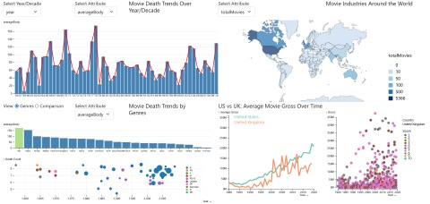|
|311 service requests|Gustavo Moreira & Sanjana Srabanti|[Github](https://github.com/uic-vis/project-3-gustavo)|[Website](https://gmmuller.github.io/)|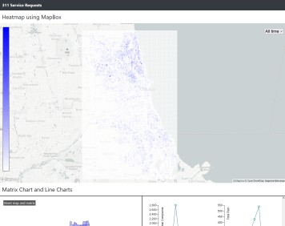|
|Divvy bike|Raka Primardika & Khanh Duy Nguyen|[Github](https://github.com/uic-vis/project-3-raka-s-team)|[Website](https://duynguyen2001.github.io/Project3CS424/)|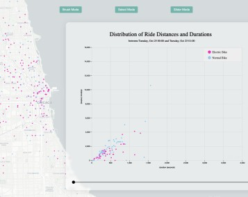|

#### Others

| Title| Group | Code & Doc | Web viewer | Preview |
| --- | --- | --- | --- |---|
| Traffic crashes | Anantha Rohan Parankusham & Venkata Likith Ayyagari | [Github](https://github.com/uic-vis/project-3-848) | [Website](https://anantharohan.github.io/) | 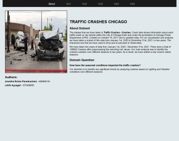|
|Divvy bike|Angelica Villegas Salazar|[Github](https://github.com/uic-vis/project-3-a)|[Website](https://sites.google.com/uic.edu/cs424-p3)|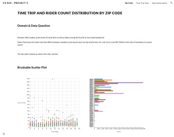|
|Chicago 'L' rideship|Adam Beigel & Logan Stein| [Github](https://github.com/uic-vis/project-3-adam-and-logan) |[Website](https://abeige.github.io/cs424-project3/site/index.html)|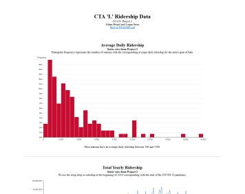|
|Divvy bike|Saksham Ayush & Deepanshu Raghuvanshi|[Github](https://github.com/uic-vis/project-3-afc-richmond)|[Website](https://sayush2.people.uic.edu/CS424/project-3-afc-richmond/)|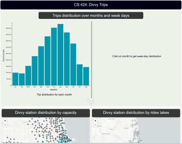|
|Traffic crashes|Jibreel Mohamed & Sajal Chandra|[Github](https://github.com/uic-vis/project-3-crime-analyst-s)|[Website](https://zofi107.github.io/project-3-crime-analyst-s/map.html)|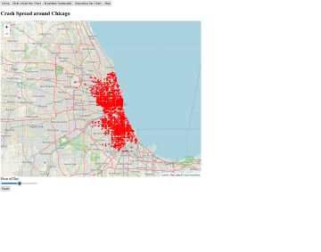|
|Chicago taxi|Keshav & Dakshya|[Github](https://github.com/uic-vis/project-3-d-and-k-divvybike-data)|[Website](https://sites.google.com/uic.edu/422project3/home?authuser=0)|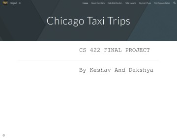|
|Traffic crashes|Mary Ashley & Daniel Quirke|[Github](https://github.com/uic-vis/project-3-data-goblins)|[Website](https://sites.google.com/uic.edu/cs424-project3/home)|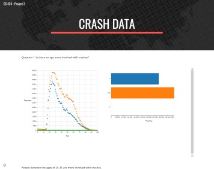|
|Divvy bike|Sylvia Joseph & Kartik Maheshwari|[Github](https://github.com/uic-vis/project-3-dream-team)|[Website](https://sjosep419.github.io/)|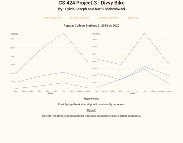|
|Red light violations|Hamza Sheikh|[Github](https://github.com/uic-vis/project-3-hamza)|[Website](https://redlightviolations.herokuapp.com/)|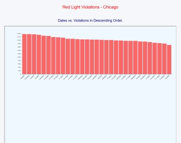|
|Chicago taxi|Yingyi Luo & Haoxuan Zeng|[Github](https://github.com/uic-vis/project-3-hzeng)|[Website](https://hzeng98.github.io/)|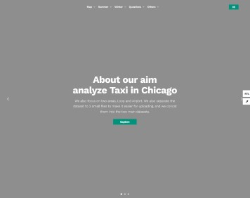|
|COVID-19|Justin Stanly|[Github](https://github.com/uic-vis/project-3-justin/tree/main/CS424_FP)|[Website](https://cs424.jusstanly.repl.co/)|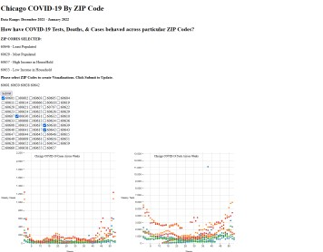|
|Deaths caused by gun|Marius Horga|[Github](https://github.com/uic-vis/project-3-marius)|||
|Traffic crashes|Ming Yu Liew|[Github](https://github.com/uic-vis/project-3-ming-yu)|[Website](https://mliew2.github.io/424/)|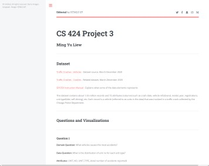|
|Red light violations|Neil Chawla|[Github](https://github.com/uic-vis/project-3-neil)|[Website](https://neilchawla.github.io/cs422_portfolio/)|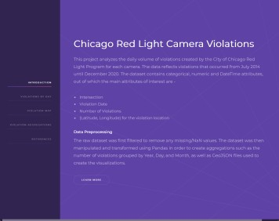|
|Crimes|Aliasgar Zakir Merchant & Siham Shweikani|[Github](https://github.com/uic-vis/project-3-siham-and-ali)|[Website](https://aliasgar-m.github.io/project-3-siham-and-ali/)|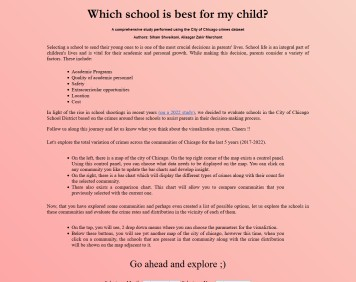|
|Chicago taxi trips|Simin Li & Ke Li|[Github](https://github.com/uic-vis/project-3-sli)|[Website](https://chloelili22.github.io/index.html)||
|COVID-19||[Github](https://github.com/uic-vis/project-3-team-a-t/blob/main/Project%203%20Documentation.md)|[Website](https://sites.google.com/uic.edu/team-a-t-project3/)|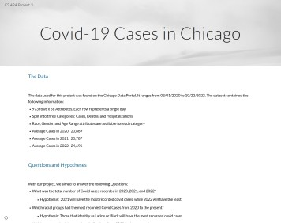|
|Speed violations|Shiva Praveen Donga & Indu Reddy Pati|[Github](https://github.com/uic-vis/project-3-team-cod)|[Website](https://indureddypati.github.io/ChicagoSpeedViolations.github.io/)|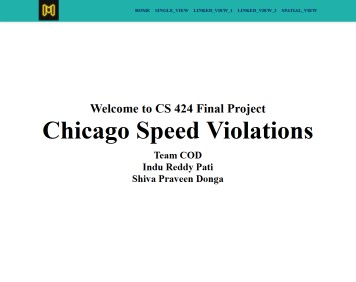|
|Traffic crashes|Yash Varma|[Github](https://github.com/uic-vis/project-3-vidyut-yash)|[Website](https://vrawal3.github.io/bubble.html)||
|Traffic crashes|Vivek Nadimpalli & Jahnavi Eega|[Github](https://github.com/uic-vis/project-3-visualizers)|[Website](https://vivekkvn.github.io/CS424_Final/)|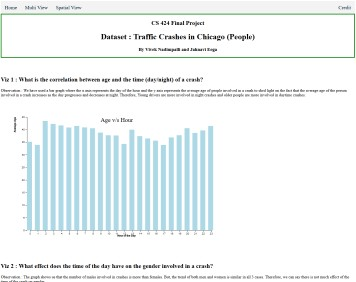|
|Chicago taxi|Swetha Jayakumar & Nihal Chandra|[Github](https://github.com/uic-vis/project-3-viz-comrades)|[Website](https://nchand26.github.io/project-3-viz-comrades/)|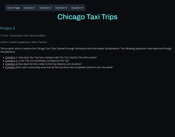|

***

#### Acknowledgements
Some of the figures and slides were adapted from [Enrico Bertini's great visualization course](http://enrico.bertini.io/teaching).

***

### Academic Integrity
UIC is an academic community committed to providing an environment in which research, learning, and scholarship can flourish and in which all endeavors are guided by academic and professional integrity. In this community, all members including faculty, administrators, staff, and students alike share the responsibility to uphold the highest standards of academic honesty and quality of academic work so that such a collegial and productive environment exists. 

As a student and member of the UIC community, you are expected to adhere to the [Community Standards](https://dos.uic.edu/community-standards/) of integrity, accountability, and respect in all of your academic endeavors. When [accusations of academic dishonesty](https://dos.uic.edu/community-standards/academic-integrity/) occur, the Office of the Dean of Students investigates and adjudicates suspected violations of this student code. Unacceptable behavior includes cheating, unauthorized collaboration, fabrication or falsification, plagiarism, multiple submissions without instructor permission, using unauthorized study aids, coercion regarding grading or evaluation of coursework, and facilitating academic misconduct. Please review the [UIC Student Disciplinary Policy](https://dos.uic.edu/wp-content/uploads/sites/262/2018/10/DOS-Student-Disciplinary-Policy-2018-2019-FINAL.pdf) for additional information about the process by which instances of academic misconduct are handled towards the goal of developing responsible student behavior.

By submitting your assignments for grading you acknowledge these terms, you declare that your work is solely your own, and you promise that, unless authorized by the instructor or proctor, you have not communicated with anyone in any way during an exam or other online assessment. Let's embrace what it means to be a UIC community member and together be committed to the values of integrity.

Please familiarize yourself with the [UIC Department of Computer Science Student Code of Conduct](https://www.cs.uic.edu/~grad/CS_Code_of_Conduct.pdf).

***

### Inclusive Learning Environment
UIC values diversity and inclusion. Regardless of age, disability, ethnicity, race, gender, gender identity, sexual orientation, socioeconomic status, geographic background, religion, political ideology, language, or culture, we expect all members of this class to contribute to a respectful, welcoming, and inclusive environment for every other member of our class. If there are aspects of the instruction or design of this course that result in barriers to your inclusion, engagement, accurate assessment or achievement, please notify me as soon as possible.

***

### Disability Accommodation Procedures
UIC is committed to full inclusion and participation of people with disabilities in all aspects of university life. If you face or anticipate disability-related barriers while at UIC, please connect with the Disability Resource Center (DRC) at [drc.uic.edu](https://drc.uic.edu/), via email at [drc@uic.edu](mailto:drc@uic.edu), or call (312) 413-2183 to create a plan for reasonable accommodations. In order to receive accommodations, you will need to disclose the disability to the DRC, complete an interactive registration process with the DRC, and provide me with a Letter of Accommodation (LOA). Upon receipt of a LOA, I will gladly work with you and the DRC to implement approved accommodations.

***

### Disclaimer
This syllabus is intended to give the student guidance in what may be covered during the semester and will be followed as closely as possible. However, as the instructor, I reserve the right to modify, supplement and make changes as the course needs arise.
