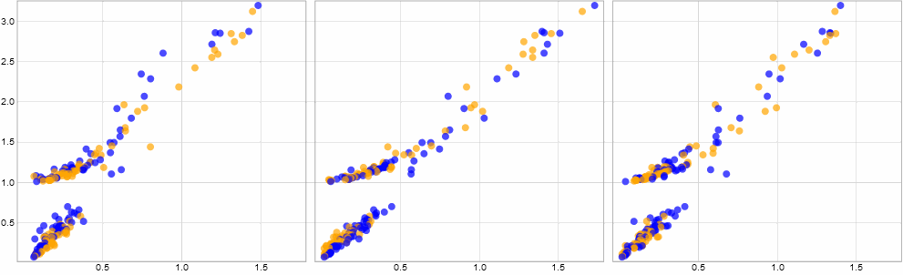

### CS424 - Visualization & Visual Analytics (Fall 2022)

Instructor: Fabio Miranda

Course webpage: https://fmiranda.me/courses/cs424-fall-2022/

---

### Project 2
The goal of this project is to get you familiar with interactive visual data exploration. We will use JavaScript, D3, and Observable to import, transform, visualize and interactively analyze a dataset. We will use GitHub to manage documentation. You should create a repository for your team on GitHub Classroom (see Piazza for invitation link).

---

#### Tasks

The tasks below follow the workflow presented in class. Make sure that you select appropriate domain and data questions; you are free to re-use your Project 1 dataset, or select a new one.

#### Task 0: Questions & data

In this task, you will need to identify a problem and formulate domain and data questions, following the example shown in class. Make sure that you have *at least* three data questions, with *at least* two of them covering three (or more) data attributes. The markdown documentation should cover the reasoning behind the questions and why you decided to select the attributes.

---

#### Task 1: Data transformation

Load the data using ObservableHQ (if the data is too large, select a subset of the data using Pandas). Transform the data in a way that enables you to answer the data questions previously identified. In other words, if you have a derived attributed (e.g., spatial aggregation, binning), make sure you are able to compute it. Just like Project 1, make sure to remove data rows with NaN or missing values.

---

#### Task 2: Visual encoding

Based on the attributes identified in the previous task, create the most appropriate charts, following the steps shown in class. For each question you identified, create at least one chart that helps you answer the question. Make sure your plots avoid common problems, such as overplotting.

---

#### Task 3: Interaction techniques

Create at least one *interactive* and *linked* juxtaposed visualization using faceting, following the steps shown in class. Your visualization must be interactive -- for example, if selecting / brushing one (or multiple) data points, the other plots that compose the visualization should be updated, highlighting the appropriate *linked* data points. It is up to you to decide and justify the use of one interaction mechanism (i.e., manipulating the data, manipulating the visual mapping, manipulating the view).

Here is an *example* of interaction between three linked scatterplots:

---

#### Task 4: Deliverables

In this project, there will be three deliverables:

1) A [markdown document](https://www.markdownguide.org/getting-started/) (``.md``), with a clear description of the dataset, summarizing the most important points, questions, data transformations, encodings, interactions and initial findings. The document should have 500-800 words.

2) A ~5 minute presentation, presenting the dataset, questions, transformations, encodings, interactions, and findings. You should upload the presentation (``.pdf`` or ``.pptx``) to your github project.

3) One or more Observable Notebooks, with each step of your exploratory process. Make sure it is *easily* reproducible and well documented, including both comments and plots.

---

#### Grading

Your submission will be graded according to the quality and coverage of the results and presentation. You need to make sure that both your deliverables (presentation and documentation) and notebooks clearly show your findings. Visualizations need to be well constructed, with good color and font choices and proper labeling.

To get a C on the assignment, you must complete tasks 0 and 1, at least two plots from task 2, and task 4. To get a B, you must complete tasks 0, 1, 2 and 4. To get an A on the assignment, you must complete all tasks.
