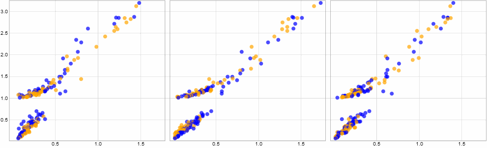

### CS424 - Visualization & Visual Analytics (Fall 2023)

Instructor: Fabio Miranda

Course webpage: https://fmiranda.me/courses/cs424-fall-2023/

---

### Assignment 2
The goal of this project is to get you familiar with visual data exploration. We will use Pandas, GeoPandas and Jupyter to import, transform, visualize and analyze a dataset. Some of the operations you will need to perform in this exploratory process have been covered in the lectures, other operations have not. Please, familiarize yourself with GeoPandas' [documentation](https://geopandas.org/en/stable/docs.html). Also note that, depending on your selected dataset, you will need to also consider *other* datasets; the most straightforward case is if you want to perform a spatial aggregation over neighborhoods -- in this case you will also need a Shapefile (or GeoJSON) with the description of the shape neighborhoods.

We will use GitHub to manage code and documentation.

---


#### Tasks

You should leverage your assignment 1 outcomes to facilitate the tasks of assignment 2. If you think you need to modify any of your outcomes, feel free to do so. Make sure that you select appropriate domain and data questions.

#### Task 0: Setting up your environment

We will be using Pandas, Geopandas, Matplotlib and Jupyter Notebook (or Jupyter Lab). Projects should be submitted using git.

[Conda](https://docs.conda.io/en/latest/) provides an easy-to-use source package and environment management system that runs on Windows, macOS and Linux. You can use other systems, but if you prefer Conda you can follow [this](https://docs.anaconda.com/anaconda/install/) installation guide, and [this](https://docs.conda.io/projects/conda/en/latest/user-guide/getting-started.html) guide to get started. Alternatively, you can also use [Miniconda](https://docs.conda.io/en/latest/miniconda.html), a minimal installer for conda.

If you are using Windows, you can use [Git for Windows](https://gitforwindows.org/) to access git and Conda.

[git](https://en.wikipedia.org/wiki/Git) is a version control system, designed to help developers track different versions of your code, synchronize them across different machines, and collaborate with others. Follow the instructions [here](https://git-scm.com/book/en/v2/Getting-Started-Installing-Git) to install git on your computer. [GitHub](https://github.com/) is a website that supports git as a service. [This](https://guides.github.com/activities/hello-world/) a nice tutorial on how to get started with git and GitHub.

We will provide a GitHub Classroom link for each assignment. Follow the link to create a repository. Use `git clone` to get a local copy of the newly created repository. After writing your code, you can push your modifications to the server using `git commit` followed by `git push`. For example, if your username is `uic-user`:

```
git clone git@github.com:uic-vis/assignment-2-uic-user.git
touch index.html
git add README.md
git commit -am "README.md file"
git push
```

#### Task 0: Questions & data

In this task, you will need to identify a problem and formulate domain and data questions, following the example shown in class. Make sure that you have *at least* three data questions, with *at least* two of them covering three (or more) data attributes. The markdown documentation should cover the reasoning behind the questions and why you decided to select the attributes.

---

#### Task 1: Data transformation

Load the data using ObservableHQ (if the data is too large, select a subset of the data using Pandas). Transform the data in a way that enables you to answer the data questions previously identified. In other words, if you have a derived attributed (e.g., spatial aggregation, binning), make sure you are able to compute it. Just like Project 1, make sure to remove data rows with NaN or missing values.

---

#### Task 2: Visual encoding

Based on the attributes identified in the previous task, create the most appropriate charts, following the steps shown in class. For each question you identified, create at least one chart that helps you answer the question. Make sure your plots avoid common problems, such as overplotting.

---

#### Task 3: Interaction techniques

Create at least **two** *interactive* visualizations -- one using single view and another using multiple linked views, following the steps shown in class. Your visualization must be interactive -- for example, if selecting / brushing one (or multiple) data points, the other plots that compose the visualization should be updated, highlighting the appropriate *linked* data points. For each visualization, use a different interaction mechanism (i.e., manipulating the data, manipulating the visual mapping, manipulating the view) and method (i.e., aggregation, filtering, change mapping, selection, navigation, spatial arrangement).

Here is an *example* of one multiple linked views visualization with three linked scatterplots:



---

#### Task 4: Deliverables

In this project, there will be three deliverables:

1) A [markdown document](https://www.markdownguide.org/getting-started/) (``.md``), with a clear description of the dataset, summarizing the most important points, questions, data transformations, encodings, interactions and initial findings. Make sure you explain *each* design choice, particularly the interaction ones. The document should have 500-800 words.

2) A ~5 minute presentation, presenting the dataset, questions, transformations, encodings, interactions, and findings. Make sure you explain *each* design choice, particularly the interaction ones. You should upload the presentation (``.pdf`` or ``.pptx``) to your github project.

3) One or more Observable Notebooks, with each step of your exploratory process. Make sure it is *easily* reproducible and well documented, including both comments and plots.

---

#### Grading

Your submission will be graded according to the quality and coverage of the results and presentation. You need to make sure that both your deliverables (presentation and documentation) and notebooks clearly show your findings. Visualizations need to be well constructed, with good color and font choices and proper labeling.

To get a C on the assignment, you must complete tasks 0 and 1, at least two plots from task 2, and task 4. To get a B, you must complete tasks 0, 1, 2 and 4. To get an A on the assignment, you must complete all tasks.
