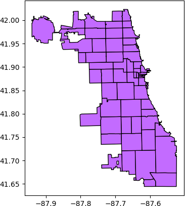

### CS424 - Visualization & Visual Analytics (Fall 2023)

Instructor: Fabio Miranda

Course webpage: https://fmiranda.me/courses/cs424-fall-2023/

---

### Lab 1: Visualizing data with Pandas and Matplotlib

The goal of this lab is to get you familiar with Anaconda, Jupyter Notebooks, Pandas, and Matplotlib. You will create a set of visualizations for exploratory data analysis. This lab will also provide an overview of common data transformation operations.

The lab is divided into four main tasks: (1) setting up your environment, (2) loading data, (3) data cleaning, and (4) data transformations and creating visualizations to analyze temporal and spatial distributions, as well as correlation between attributes.

---

### Tasks

#### Task 0: Setting up your environment

For this lab, we will rely on the [Anaconda](https://www.anaconda.com/) (or [Miniconda](https://docs.conda.io/projects/miniconda/en/latest/#)) to manage Python packages. Feel free to use either Anaconda or Miniconda (see a discussion about this [here](https://docs.conda.io/projects/conda/en/stable/user-guide/install/download.html#anaconda-or-miniconda)).

First, follow these instructions to install [Anaconda](https://docs.anaconda.com/free/anaconda/install/index.html). Alternatively, follow [these](https://docs.conda.io/projects/miniconda/en/latest/miniconda-install.html) instructions to install Miniconda.

Now, you will need to use a command prompt or terminal to create environments and install packages. On Windows, this can be done either through the Anaconda Powershell Prompt (installed with Anaconda or Miniconda) or Git Bash (a bash alternative for Windows, check [here](https://gitforwindows.org/)). On Mac OSX or Linux, use the usual terminal.

Open the appropriate command prompt in your operating system and type the following to create and activate a new [conda environment](https://docs.conda.io/projects/conda/en/latest/user-guide/concepts/environments.html) (named lab1 and using Python 3.8) for this lab:


```console
conda create -n lab1 python=3.8
conda activate lab1
```

To install the required packages in the newly created environment, type:

```console
pip install geopandas matplotlib jupyter
```

In this lab, we will rely on three datasets for Chicago:

* [COVID-19 cases data](covid-cases-tests-deaths.csv)
* [Sociodemographics data](chicago-sociodemographics.csv)
* [ZIP code boundaries](boundaries-zipcode.geojson)

Download the files to an appropriate folder. If you would like to check the answers, you can download the Jupyter notebook [here](lab-1.ipynb).

#### Task 1: Loading the data and initial exploration

In the same environment that you previously created and folder that you used to dowload the files, start a Jupyter notebook server by typing in the terminal:

```console
jupyter notebook
```

When the notebook opens in your browser, create a new notebook. First, import the necessary libraries in a notebook cell:

```python
import geopandas as gpd
import pandas as pd
import numpy as np
from matplotlib import pyplot as plt
```

And [load the data](https://geopandas.org/en/stable/docs/user_guide/io.html) using GeoPandas:
```python
df_soc = pd.read_csv('chicago-sociodemographics.csv')
df_covid = pd.read_csv('covid-cases-tests-deaths.csv')
gdf = gpd.read_file("boundaries-zipcode.geojson")
```

Next, we will cover the initial data exploration, including displaying sample records, summarizing statistics, and filtering examples. To have an overview of the sociodemographics data, in separate cells type:

```python
df_soc.head() # display the first 5 rows
```

```python
df_soc.columns # check all column names
```

```python
df_soc.describe() # summary statistics
```

```python
df_soc['Asia(%)'].describe()' # summary statistics for a specific column
```

Using the loaded dataframes, you can easily perform data queries, such as finding the ZIP code with the highest percentage of foreign born population:

```python
df_soc[df_soc['Foreign Born Population(%)'] == df_soc['Foreign Born Population(%)'].max()] 
```

Or finding the ZIP codes with median housing value below than or equal to the mean, and population less than or equal to 30,000:
```python
df_soc[(df_soc['Median housing value'] <= df_soc['Median housing value'].mean()) & (df_soc['Population'] <= 30000)][['zipcode', 'Median housing value', 'Population']] 
```

In this task, repeat the overview operations, but now for the COVID dataframe (`df_covid`).

#### Task 2: Data cleaning

##### Renaming columns
We will use the ZIP geojson to aggregate the data by the ZIP areas. Notice that there is a mismatch between the ZIP-related columns of the dataframes (using either zip or zipcode for the ZIP attribute). To ensure the same name, rename the columns to zipcode:

```python
gdf = gdf.rename(columns={"zip": "zipcode"}) # rename the column name to match the other dataframe
gdf['zipcode'] = gdf['zipcode'].astype(str).astype(int) # convert zipcode from string to integer
zipcodes = gdf['zipcode'].unique().tolist() # get a list of all zipcodes
```

`gdf.head()` will give you an overview of the dataframe. To plot the areas, you can use:

```python
gdf.plot(figsize=(5,5), color='#756bb1', edgecolor='black')
```

You should visualize something similar to:



##### Cleaning the data
The COVID dataframe contains a number of issues that must be properly addressed. We should, at the very least:
* Fill missing values with 0
* Convert date to datetime objects
* Remove rows with unknown zipcode, or not in the list of zipcodes in the geojson
* Convert zipcode from string to integer

This can be achieved with:

```python
df_covid = df_covid.fillna(0) # fill all missing values with 0
df_covid['Week Start'] = pd.to_datetime(df_covid['Week Start']).dt.date # convert date to datetime object
df_covid['Week End'] = pd.to_datetime(df_covid['Week End']).dt.date # convert date to datetime object
df_covid = df_covid[df_covid['ZIP Code'] != 'Unknown'] # remove rows with unknown zipcode
df_covid['ZIP Code'] = df_covid['ZIP Code'].astype(int) # convert zipcode from string to integer

df_covid = df_covid[df_covid['ZIP Code'].isin(zipcodes)] # remove rows with zipcode not in the list of zipcodes in the geojson file
df_covid = df_covid.sort_values(by='Week End') # sort by date
df_covid = df_covid.rename(columns={'Week End': 'date', 'Cases - Weekly': 'cases', 'Deaths - Weekly': 'deaths', 'ZIP Code': 'zipcode'}) # rename columns
df_covid['cases'] = df_covid['cases'].astype(int) # convert cases to integer
df_covid['deaths'] = df_covid['deaths'].astype(int) # convert deaths to integer
```

#### Task 3: Creating visualizations

#### Visualization 1: Number of cases and deaths over time

In order to create a visualization with the temporal distribution of cases and deaths, we first need to aggregate these measures over some temporal resolution (e.g., date). This can be achieved with Pandas using the [groupby](https://pandas.pydata.org/docs/reference/api/pandas.DataFrame.groupby.html) operation:

```python
df_agg_by_date = df_covid[['date','cases', 'deaths']] # select columns
df_agg_by_date = df_agg_by_date.groupby('date').sum() # aggregate by date
df_agg_by_date = df_agg_by_date.reset_index() # reset index
```

As an exercise, check (with `.head()`) the difference between the dataframe before and after the `.reset_index()` operation.

Now, to plot the data using Matplotlib, we need to use the [plot](https://matplotlib.org/stable/api/_as_gen/matplotlib.pyplot.plot.html) method, specifying x and y (i.e., in or example, date and deaths or cases):

```python
fig, ((ax1, ax2)) = plt.subplots(nrows=2, ncols=1, figsize=(30,18)) # create a figure with 2 subplots
ax1.plot(df_agg_by_date['date'], df_agg_by_date['deaths'], color='Red')

# set figure properties:
ax1.set_xlabel("Date")
ax1.set_ylabel("Deaths")
ax1.set_title("Covid Daily Death Counts in Chicago")
ax1.title.set_size(24)
ax1.xaxis.label.set_size(22)
ax1.yaxis.label.set_size(22)
ax1.tick_params(axis='both', which='major', labelsize=20)
```

You should follow similar steps for the cases over time. In the end, you should have some similar to the following visualization:


Pandas also gives you the ability to aggregate over different temporal resolutions using the `Grouper` function. For more information, see [here](https://pandas.pydata.org/docs/reference/api/pandas.Grouper.html).

#### Resources

* [Conda cheatsheet](https://conda.io/projects/conda/en/latest/_downloads/843d9e0198f2a193a3484886fa28163c/conda-cheatsheet.pdf)
* [Running Jupyter notebooks](https://docs.jupyter.org/en/latest/running.html)
* [Panda merge](https://pandas.pydata.org/docs/reference/api/pandas.DataFrame.merge.html)
