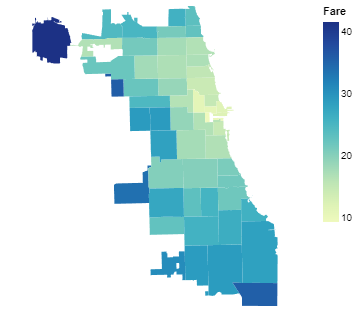
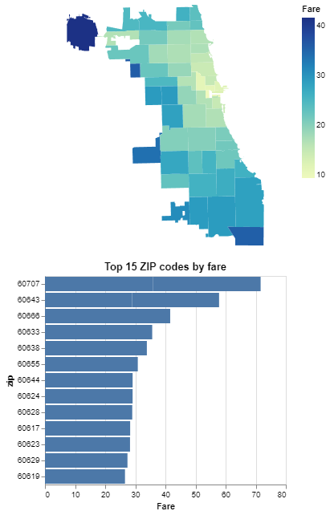

### CS424 - Visualization & Visual Analytics (Fall 2025)

Instructor: Fabio Miranda

Course webpage: https://fmiranda.me/courses/cs424-fall-2025/

---

### Lab 2: Visualizing data with GeoPandas and Altair

The goal of this lab is to introduce students to geospatial data visualization using GeoPandas and Altair. You will learn how to load, manipulate, and visualize geospatial data using Python libraries. This lab will also cover basic spatial joins and aggregation techniques for creating meaningful geospatial visualizations.

The lab is divided into four main tasks: (1) setting up your environment, (2) loading geospatial data, (3) performing spatial operations, and (4) creating geospatial visualizations.

---

### Tasks

#### Task 0: Setting up your environment

For this lab, we will rely on the [Anaconda](https://www.anaconda.com/) (or [Miniconda](https://docs.conda.io/projects/miniconda/en/latest/#)) to manage Python packages.

First, install Anaconda by following [these instructions](https://docs.anaconda.com/free/anaconda/install/index.html), or install Miniconda using [these instructions](https://docs.conda.io/projects/miniconda/en/latest/miniconda-install.html).

Verify command line access:
- On Windows, open Anaconda Prompt or Command Prompt (cmd.exe).
- On macOS/Linux, open Terminal.
- Type `conda --version` and `python --version` to check installation.
- Alternatively, you can install other terminals, such as [Hyper](https://hyper.is/) or [Git BASH](https://gitforwindows.org/).

Next, create a new conda environment and install the required packages:

```console
conda create -n lab2
conda activate lab2
pip install geopandas altair pandas jupyter
```

Test installation from the command line by creating a file `test.py` with the following contents:

```python
import geopandas as gpd
import altair as alt
import pandas as pd
print("GeoPandas, Altair, and Pandas installed correctly!")
```

Run it from the command line:

```console
python test.py
```

Download the dataset required for this lab:

* [Taxi Trips data](../../data/Taxi_Trips.csv)
* [Chicago ZIP code boundaries](../../data/chicago.geojson)

#### Task 1: Loading the data and initial exploration

Start a Jupyter notebook server:

```console
jupyter notebook
```

Import the necessary libraries and load the data:

```python
import pandas as pd
import geopandas as gpd
import altair as alt
from shapely.geometry import Point

df = pd.read_csv('data/Taxi_Trips.csv')
geometry = [Point(xy) for xy in zip(df['Pickup Centroid Longitude'], df['Pickup Centroid Latitude'])]
gdf = gpd.GeoDataFrame(df, geometry=geometry, crs=4326)
```

To display the first few rows:

```python
gdf.head()
```

#### Task 2: Performing spatial operations

Load the Chicago ZIP code boundaries dataset:

```python
chicago = gpd.read_file('data/chicago.geojson')
```

Perform a spatial join between taxi trip data and Chicago ZIP codes to aggregate fare data by ZIP code:

```python
gdf = gpd.sjoin(gdf, chicago, predicate='within')
joined = gdf.groupby('zip').agg({'Fare': 'mean'})
joined = joined.filter(['Fare'])
```

Merge the aggregated data back with the Chicago ZIP code boundaries:

```python
merged = chicago.merge(joined, on='zip')
```

#### Task 3: Creating geospatial visualizations

Create a basic geospatial visualization using Altair:

```python
alt.Chart(gdf.sample(500)).mark_geoshape()
```

Color the map based on fare values:

```python
alt.Chart(gdf.sample(500)).mark_geoshape().encode(color='Fare')
```

To visualize a choropleth map of the aggregated fare data:

```python
alt.Chart(merged).mark_geoshape().encode(color='Fare').project(type='mercator')
```



#### Task 4: Creating a bar chart of top ZIP codes by fare

To visualize the top 15 ZIP codes by fare values, create a bar chart:

```python
bar = alt.Chart(merged.nlargest(15, "Fare"), title="Top 15 ZIP codes by fare").mark_bar().encode(
        x="Fare",
        y=alt.Y("zip").sort("-x"),
    )
```

Additionally, we can add an interactive selection to highlight ZIP codes on both the map and bar chart:

```python
click_zip = alt.selection_point(fields=["zip"])
opacity = alt.when(click_zip).then(alt.value(1)).otherwise(alt.value(0.2))

choropleth = alt.Chart(merged).mark_geoshape().encode(color='Fare').project(type='mercator').encode(opacity=opacity)

bar = alt.Chart(merged.nlargest(15, "Fare"), title="Top 15 ZIP codes by fare").mark_bar().encode(
        x="Fare",
        opacity=opacity,
        y=alt.Y("zip").sort("-x"),
    )

(choropleth & bar).add_params(click_zip)
```

This creates an interactive visualization where clicking a ZIP code on the bar chart will highlight it on the map. The result should be similar to the following image:



#### Resources

* [GeoPandas documentation](https://geopandas.org/en/stable/)
* [Altair documentation](https://altair-viz.github.io/)
* [Pandas documentation](https://pandas.pydata.org/docs/)
