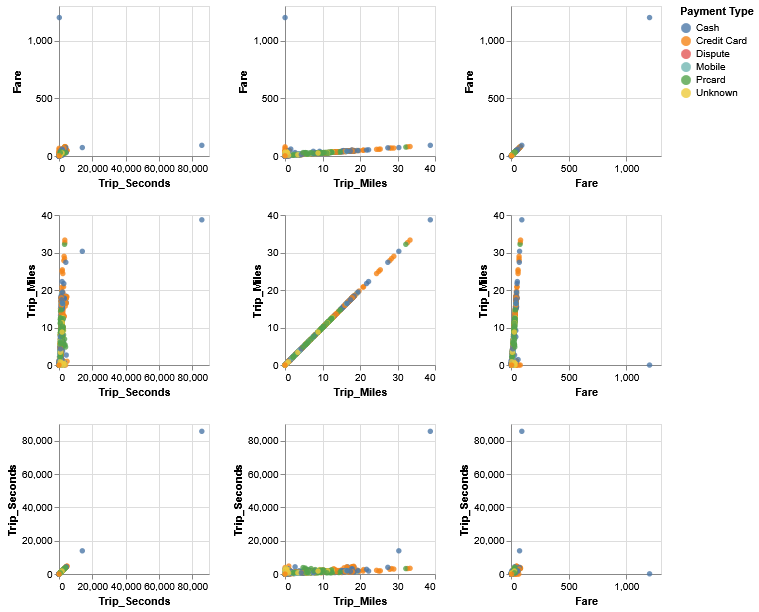
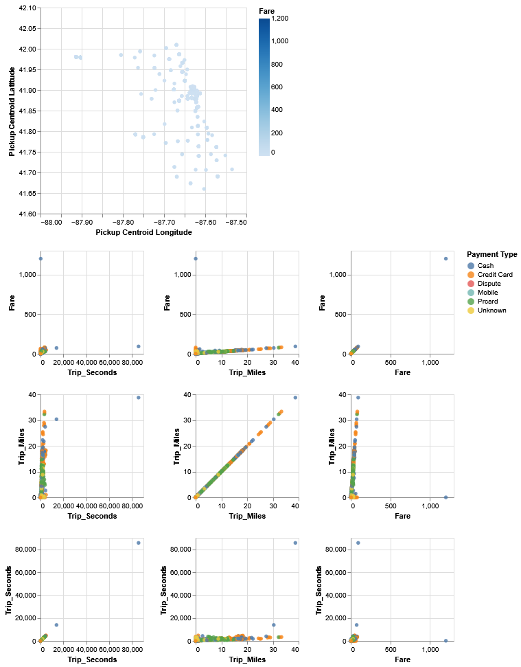

### CS424 - Visualization & Visual Analytics (Spring 2025)

Instructor: Fabio Miranda

Course webpage: https://fmiranda.me/courses/cs424-spring-2025/

---

### Lab 3: Visualizing data with GeoPandas and Altair

The goal of this lab is to introduce students to the concept of multiple coordinated views in data visualization using Altair. You will learn how to create linked visualizations that allow users to explore data interactively. This lab will cover scatter plots, bar charts, histograms, line charts, and geospatial visualizations, along with brushing and selection techniques for linking views.

The lab is divided into four main tasks: (1) setting up your environment, (2) loading and processing data, (3) creating multiple linked visualizations, and (4) adding interactivity.

You can download the final Jupyter notebook [here](lab-4.ipynb).

---

### Tasks

#### Task 0: Setting up your environment

For this lab, we will rely on the [Anaconda](https://www.anaconda.com/) (or [Miniconda](https://docs.conda.io/projects/miniconda/en/latest/#)) to manage Python packages.

First, install Anaconda by following [these instructions](https://docs.anaconda.com/free/anaconda/install/index.html), or install Miniconda using [these instructions](https://docs.conda.io/projects/miniconda/en/latest/miniconda-install.html).

Next, create a new conda environment and install the required packages:

```console
conda create -n lab3 python=3.8
conda activate lab3
pip install geopandas altair pandas jupyter
```

Download the dataset required for this lab:

* [Taxi Trips data](../../data/Taxi_Trips.csv)
* [Chicago ZIP code boundaries](../../data/chicago.geojson)

#### Task 1: Loading the data and initial exploration

Start a Jupyter notebook server:

```console
jupyter notebook
```

Import the necessary libraries and load the data:

```python
import pandas as pd
import geopandas as gpd
import altair as alt
from shapely.geometry import Point

df = pd.read_csv('data/Taxi_Trips.csv')
geometry = [Point(xy) for xy in zip(df['Pickup Centroid Longitude'], df['Pickup Centroid Latitude'])]
gdf = gpd.GeoDataFrame(df, geometry=geometry, crs=4326).sample(1000)
gdf = gdf.rename(columns={"Trip Seconds": "Trip_Seconds", "Trip Miles": "Trip_Miles"})
```

Note that we are renaming certain columns to remove white spaces. To display the first few rows:

```python
gdf.head()
```

#### Task 2: Performing spatial operations

Load the Chicago ZIP code boundaries dataset:

```python
chicago = gpd.read_file('data/chicago.geojson')
```

Perform a spatial join between taxi trip data and Chicago ZIP codes to aggregate fare data by ZIP code:

```python
joined = gpd.sjoin(gdf, chicago, predicate='within')
joined = joined.groupby('zip').mean()
joined = joined.filter(['Fare'])
```

Merge the aggregated data back with the Chicago ZIP code boundaries:

```python
merged = chicago.merge(joined, on='zip')
```

#### Task 3: Creating linked views

Create a basic linked view with scatter plots using Altair:

```python
brush = alt.selection_interval()

matrix = alt.Chart(gdf).mark_circle().add_params(brush).encode(
    alt.X(alt.repeat("column"), type='quantitative'),
    alt.Y(alt.repeat("row"), type='quantitative'),
    color=alt.condition(brush, 'Payment Type:N', alt.value('grey')),
    opacity=alt.condition(brush, alt.value(0.8), alt.value(0.1))
).properties(
    width=150,
    height=150
).repeat(
    row=['Fare', 'Trip_Miles', 'Trip_Seconds'],
    column=['Trip_Seconds', 'Trip_Miles', 'Fare']
)

matrix

```



#### Task 4: Link the scatter plots with a visualization of the spatial attributes

To visualize the spatial distribution of pickups:

```python
scatter = alt.Chart(gdf).mark_circle().encode(
    x=alt.Y('Pickup Centroid Longitude',scale=alt.Scale(domain=[-88.0, -87.5])),
    y=alt.Y('Pickup Centroid Latitude',scale=alt.Scale(domain=[41.6, 42.1])),
    color='Fare',
    opacity=alt.condition(brush, alt.value(1), alt.value(0))
)
```

Additionally, we can add an interactive selection to highlight points in all charts:

```python
brush = alt.selection_interval()
(scatter & matrix).add_params(brush)
```

The result should be similar to the following image:



#### Resources

* [GeoPandas documentation](https://geopandas.org/en/stable/)
* [Altair documentation](https://altair-viz.github.io/)
* [Pandas documentation](https://pandas.pydata.org/docs/)

