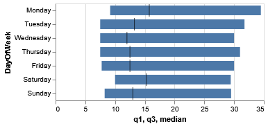
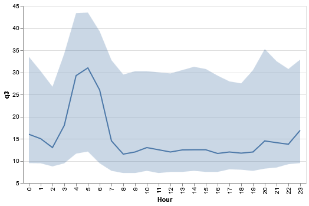

### CS424 - Visualization & Visual Analytics (Spring 2025)

Instructor: Fabio Miranda

Course webpage: https://fmiranda.me/courses/cs424-spring-2025/

---

### Lab 5: Visualizing Aggregated Taxi Trip Data with GeoPandas and Altair

The goal of this lab is to introduce students to the concept of uncertainty visualization using GeoPandas and Altair.

The lab is divided into four main tasks: (1) setting up your environment, (2) loading and processing data, (3) creating box plots and error band visualizations using Vega-Lite specifications..

You can download the final Jupyter notebook [here](lab-5.ipynb).

---

### Tasks

#### Task 0: Setting up your environment

For this lab, we will rely on the [Anaconda](https://www.anaconda.com/) (or [Miniconda](https://docs.conda.io/projects/miniconda/en/latest/#)) to manage Python packages.

First, install Anaconda by following [these instructions](https://docs.anaconda.com/free/anaconda/install/index.html), or install Miniconda using [these instructions](https://docs.conda.io/projects/miniconda/en/latest/miniconda-install.html).

Next, create a new conda environment and install the required packages:

```console
conda create -n lab5
conda activate lab5
pip install geopandas altair pandas jupyter
```

Download the dataset required for this lab:

* [Taxi Trips data](../../data/Taxi_Trips.csv)
* [Chicago ZIP code boundaries](../../data/chicago.geojson)

#### Task 1: Loading the data and initial exploration

Start a Jupyter notebook server:

```console
jupyter notebook
```

Import the necessary libraries and load the data:

```python
import pandas as pd
import geopandas as gpd
import altair as alt
from shapely.geometry import Point

df = pd.read_csv('data/Taxi_Trips.csv')
geometry = [Point(xy) for xy in zip(df['Pickup Centroid Longitude'], df['Pickup Centroid Latitude'])]
gdf = gpd.GeoDataFrame(df, geometry=geometry, crs=4326).sample(1000)
gdf = gdf.rename(columns={"Trip Seconds": "Trip_Seconds", "Trip Miles": "Trip_Miles"})
```

Note that we are renaming certain columns to remove white spaces. To display the first few rows:

```python
gdf.head()
```

#### Task 2: Aggregating Data for Visualization

We will first convert a column to datetime:

```python
df['Trip Start Timestamp'] = pd.to_datetime(df['Trip Start Timestamp'], format='%m/%d/%Y %I:%M:%S %p', errors='coerce')
df = df.dropna(subset=['Trip Start Timestamp'])  # Remove rows where parsing failed
```

And create a new column with the day of the week:

```python
df['DayOfWeek'] = df['Trip Start Timestamp'].dt.day_name()
```

Now we will aggregate the fare column:

```python
agg_df = df.groupby('DayOfWeek')['Fare'].agg([
    ('min', 'min'),
    ('q1', lambda x: x.quantile(0.25)),
    ('median', 'median'),
    ('q3', lambda x: x.quantile(0.75)),
    ('max', 'max')
]).reset_index()
```

And order the columns by the day of the week:

```python
weekday_order = ["Monday", "Tuesday", "Wednesday", "Thursday", "Friday", "Saturday", "Sunday"]
agg_df['DayOfWeek'] = pd.Categorical(agg_df['DayOfWeek'], categories=weekday_order, ordered=True)

# Now sort based on this order
agg_df = agg_df.sort_values(by=['DayOfWeek'])
```

#### Task 3: Creating a box plot

We will create a box plot by using a Vega-Lite specification:

```python
spec = """
{
  "$schema": "https://vega.github.io/schema/vega-lite/v5.json",
  "data": {"values": %s},
  "encoding": {"y": {"field": "DayOfWeek", "type": "nominal", "sort": ["Monday", "Tuesday", "Wednesday", "Thursday", "Friday", "Saturday", "Sunday"]}},
  "layer": [
    {
      "mark": {"type": "bar", "size": 14},
      "encoding": {
        "x": {"field": "q1", "type": "quantitative"},
        "x2": {"field": "q3"}
      }
    },
    {
      "mark": {"type": "tick", "color": "black", "size": 18},
      "encoding": {
        "x": {"field": "median", "type": "quantitative"}
      }
    }
  ]
}

"""%agg_df.to_json(orient='records')

chart = alt.Chart.from_json(spec)
chart
```

Note that in the previous specification, we are passing the aggregated values instead of the raw trips.




#### Task 4: Creating a error band visualization

Now we will create an error band visualization, considering aggregations over the hours of the day:

```python
df['Hour'] = df['Trip Start Timestamp'].dt.hour

agg_df = df.groupby('Hour')['Fare'].agg([
    ('min', 'min'),
    ('q1', lambda x: x.quantile(0.25)),
    ('median', 'median'),
    ('q3', lambda x: x.quantile(0.75)),
    ('max', 'max')
]).reset_index()
```

The following Vega-Lite specification creates an error band with the quartiles and a line with the median value:

```python
spec = """
{
  "$schema": "https://vega.github.io/schema/vega-lite/v5.json",
  "data": {"values": %s},
  "layer": [
    {
      "mark": "errorband",
      "encoding": {
        "y": {
          "field": "q3",
          "type": "quantitative",
          "scale": {"zero": false}
        },
        "y2": {"field": "q1"},
        "x": {
          "field": "Hour"
        }
      }
    },
    {
      "mark": "line",
      "encoding": {
        "y": {
          "field": "median",
          "type": "quantitative"
        },
        "x": {
          "field": "Hour"
        }
      }
    }
  ]
}

"""%agg_df.to_json(orient='records')

chart = alt.Chart.from_json(spec)
chart

```

The result should be similar to the following image:



#### Resources

* [GeoPandas documentation](https://geopandas.org/en/stable/)
* [Altair documentation](https://altair-viz.github.io/)
* [Pandas documentation](https://pandas.pydata.org/docs/)

