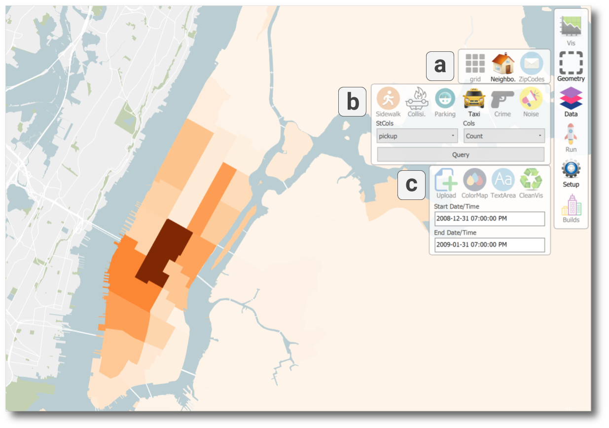

 
 

### Research Areas

The analysis of large and complex data is usually an exploratory process in which domain expertise plays a significant role. It is, therefore, essential to integrate the user into the analysis loop, enabling them to formulate hypotheses and gain new insights into domain-specific problems. Interactive visualization is central in the support of this process. My research focuses on proposing new methods and systems that allow for the interactive visual analysis of large data sets, combining **visualization**, **hci**, **computer graphics**, **data management**, and **machine learning** in order to tackle fundamental challenges in data science, enable effective analysis of large data and untangle real-world problems. I am particularly interested in making contributions that can help address different problems cities face by integrating data on different resolutions and from different sources. 

On this page you will find information about my research, the city of Chicago, the University of Illinois at Chicago, and open positions.

 
 

The figure above highlights some of the papers I have published over the past few years, contributing new techniques, methods and tools for the analysis of large data:  
**(a)** Fast accumulation of shadows to compute the shadow impact on public spaces from new proposed buildings and an alternate scenario (highlighted in purple) in Manhattan (NYC) ([paper](https://fmiranda.me/publications/shadow-accrual-maps/)).  
**(b)** Comparison of locations across NYC and San Francisco using computational topology. *Pulses* are computed using a collection of time-varying scalar functions over different temporal resolutions ([paper](https://fmiranda.me/publications/urban-pulse/)).  
**(c)** Using convolutional neural network features to assess the condition of curb cuts before and after snowfall in regions having a higher concentration of older adults ([paper](https://fmiranda.me/publications/urban-mosaic/)).  
**(d)** A graph neural network to model commuting flows between census tracts in NYC, considering geographic contextual information and urban indicators ([paper](https://fmiranda.me/publications/gmel/)).

***
#### Table of Contents
1. [Themes](#themes)
    1. [Visual data analysis](#visual-data-analysis)
    2. [3D analytics](#3d-analytics)
    3. [Data structures and indices](#data-structures-and-indices)
    4. [Machine learning](#machine-learning)
2. [Chicago](#chicago)
3. [University of Illinois at Chicago](#university-of-illinois-at-chicago)
4. [Open positions](#open-positions)
    1. [PhD students](#phd-students)
    2. [MSc students](#msc-students)
    3. [BSc students](#bsc-students)
    4. [Visiting researchers](#visiting-researchers)

***
### Themes
Below I highlight some of my current interests. Note that a paper (or research project) can fall under multiple themes, as it makes use of (or contributes to) multiple fields in computer science. Also, note that this is a non-exhaustive list, and the main goal is to give a general idea of my work and research.

#### Visual data analysis

Effective analysis and exploration of data require feedback loops and close collaboration with domain experts and stakeholders to understand their needs and expectations. Well-designed visualizations and interactions enable users to gain actionable insights into problems by formulating and testing hypotheses, and address domain specific challenges. In my research I am interested in: proposing new visual representations, data mining techniques, and query models that enable easy and effective exploration of large data. 

##### Example of papers
* *Shadow Accrual Maps: Efficient Accumulation of City-Scale Shadows over Time*, IEEE Transactions on Visualization and Computer Graphics ([link](https://fmiranda.me/publications/shadow-accrual-maps/))
* *Time Lattice: A Data Structure for the Interactive Visual Analysis of Large Time Series*, Computer Graphics Forum ([link](https://fmiranda.me/papers/time-lattice/))
* *Interactive Visual Exploration of Spatio-Temporal Urban Data Sets using Urbane*, SIGMOD 2018 Best Demo ([link](https://fmiranda.me/publications/raster-join-demo/))
* *Urban Pulse: Capturing the Rhythm of Cities*, IEEE Transactions on Visualization and Computer Graphics ([paper](https://fmiranda.me/publications/urban-pulse/))

##### Current projects
* Visualization of probability distributions of geographical data.
* Interactive profiling of city land use evolution.
* Visual data exploration through user-steerable projections.

***

#### 3D Analytics

The rise of new sensing initiatives has created data sets that go beyond the usual flatland spatiotemporal data, capturing a new perspective of the city at an unprecedented scale. Examples of such initiatives are aerial surveys and collaborative mapping. The interactive analysis of such data creates the perfect opportunity to explore new urban features at a scale that was not possible before. In my research I make use of these novel data sets to propose new techniques and systems to virtually explore cities as well as analyze important problems facing cities today, such as shadow impact and accessibility.

##### Example of papers
* *Shadow Accrual Maps: Efficient Accumulation of City-Scale Shadows over Time*, IEEE Transactions on Visualization and Computer Graphics ([link](https://fmiranda.me/publications/shadow-accrual-maps/))
* *Interactive Visual Exploration of Spatio-Temporal Urban Data Sets using Urbane*, SIGMOD 2018 Best Demo ([link](https://fmiranda.me/publications/raster-join-demo/))

##### Current projects
* Urban navigation in virtual reality.

***

#### Data structures and indices

In order to be most effective, visual analytics systems must be interactive, requiring sub-second response times. General approaches often fail to drive this interactivity, as the scale of the data presents several challenges. In my research, I propose data structures and indices to enable the interactive visual analysis of various large data sets.

##### Example of papers
* *Time Lattice: A Data Structure for the Interactive Visual Analysis of Large Time Series*, Computer Graphics Forum ([link](https://fmiranda.me/publications/time-lattice/))
* *Interactive Visual Exploration of Spatio-Temporal Urban Data Sets using Urbane*, SIGMOD 2018 Best Demo ([link](https://fmiranda.me/publications/raster-join-demo/))
* *TopKube: A Rank-Aware Data Cube for Real-Time Exploration of Spatiotemporal Datasets*, IEEE Transactions on Visualization and Computer Graphics ([link](https://fmiranda.me/publications/topkube/))

##### Current projects
* Interactive exploration of large image databases.
* Interactive visual analysis with learned structures.

***

#### Machine learning

New sources of data have enabled us to quantify the urban environment at unprecedented scale and detail, allowing us to tackle new questions in urban science. It is increasingly necessary to investigate and propose new machine learning techniques that are able to 1) extract meaningful data from this urban data exhaust, and 2) model important urban phenomena.

##### Example of papers
* *Urban Mosaic: Visual Exploration of Streetscapes Using Large-Scale Image Data*, CHI 2020 ([link](https://fmiranda.me/publications/urban-mosaic/))
* *Learning Geo-Contextual Embeddings for Commuting Flow Prediction*, AAAI 2020 ([link](https://fmiranda.me/publications/gmel/))

##### Current works
* Commuting trip distribution modeling using graph neural network.
* Automatic assessment of built environment from street-level images.

***
### Chicago

 
 

Chicago is an energetic and vibrant city located in the state of Illinois, with more than 600 [parks](https://www.chicagoparkdistrict.com/), 26 miles of [beaches](https://www.chicagoparkdistrict.com/parks-facilities/beaches), and home to world-renowned museums, including the [Field Museum](http://www.fieldmuseum.org/) and the [Chicago History Museum](http://www.chicagohistory.org/). Chicago is also home to an extensive transportation system, with accessible [trains and buses](http://www.transitchicago.com/), and [bikes](http://www.divvybikes.com/about). 

Chicago hosts [Lollapalooza](https://www.lollapalooza.com/), [Pitchfork Music Festival](https://pitchforkmusicfestival.com/), and has some of the most famous [jazz festivals](https://www.visittheusa.com/experience/all-jazz-7-us-cities-discover-music-and-more) and [clubs](https://www.timeout.com/chicago/music/13-best-jazz-clubs-in-chicago) in the world. To top it off, Chicago is home to the [Chicago Bulls](https://www.nba.com/bulls/), [Chicago White Sox](https://www.nba.com/bulls/), [Chicago Cubs](https://www.mlb.com/cubs), and the [Chicago Bears](https://www.chicagobears.com/).

Recently, Chicago has been voted the "Best Big City in the U.S." by Condé Nast Traveler for the fourth consecutive year (see [here](https://www.cntraveler.com/gallery/best-cities-us)), the third best city in the world by TimeOut (see [here](https://www.timeout.com/things-to-do/best-cities-in-the-world)), and one of the most walkable cities in the U.S. (see [here](https://www.smartertravel.com/10-most-walkable-cities-in-america/)).

You can find more information about Chicago [here](https://www.uic.edu/chicago).

***
### University of Illinois at Chicago

UIC is located in the heart of Chicago. It is the largest university in the Chicago area, with more than 33,000 students. It ranks 14th among public universities in the "QS World University Rankings: USA" (see [here](https://today.uic.edu/uic-ranks-14th-among-public-universities-in-qs-world-university-rankings-usa)), and top 10 best value, and top 25 public universities according to the Wall Street Journal / Times Higher Education's national rankings (see [here](https://today.uic.edu/uic-ranks-14th-among-public-universities-in-qs-world-university-rankings-usa)).

UIC has been named a "R1: Doctoral Universities – Very high research activity" institution by the [Carnegie Classification](https://carnegieclassifications.iu.edu/lookup/view_institution.php?unit_id=145600&start_page=lookup.php&clq=%7B%22ipug2005_ids%22%3A%22%22%2C%22ipgrad2005_ids%22%3A%22%22%2C%22enrprofile2005_ids%22%3A%22%22%2C%22ugprfile2005_ids%22%3A%22%22%2C%22sizeset2005_ids%22%3A%22%22%2C%22basic2005_ids%22%3A%22%22%2C%22eng2005_ids%22%3A%22%22%2C%22search_string%22%3A%22chicago%22%2C%22level%22%3A%22%22%2C%22control%22%3A%22%22%2C%22accred%22%3A%22%22%2C%22state%22%3A%22%22%2C%22region%22%3A%22%22%2C%22urbanicity%22%3A%22%22%2C%22womens%22%3A%22%22%2C%22hbcu%22%3A%22%22%2C%22hsi%22%3A%22%22%2C%22tribal%22%3A%22%22%2C%22msi%22%3A%22%22%2C%22landgrant%22%3A%22%22%2C%22coplac%22%3A%22%22%2C%22urban%22%3A%22%22%2C%22community%22%3A%22%22%7D) (the highest category among doctoral universities).

UIC's Computer Science Department ranks 34th in the top CS departments in the US according to [CSRankings](http://csrankings.org/). UIC is also home to the [Electronic Visualization Laboratory (EVL)](https://www.evl.uic.edu/), an interdisciplinary  graduate research laboratory specializing in visualization and advanced networks. Established in 1973, it is a joint effort of UIC’s College of Engineering and School of Art and Design, representing the oldest formal collaboration between engineering and art in the US. EVL’s research areas include scientific visualization, virtual reality, computer-supported collaborative work, network performance, distributed computing, and human-computer interfaces.

***
### Open positions
#### PhD students
I have several open positions for PhD students. If you are interested in working with me, send me an email (fabiom {at} uic {dot} edu) with your CV and we will try to schedule a meeting to discuss your background, interests and goals. This will also be an opportunity for you to ask questions about my research, topics of interest, the application process, or PhD life in general. I am looking for motivated students with a strong programming background and *some* knowledge or interest in either one of my broad areas of interest (visualization, computer graphics, data management, or machine learning - see details above).

For more information about the Computer Science PhD program at UIC, please check [this link](https://cs.uic.edu/graduate/admissions/).

#### MSc students
If you are a UIC MSc student and you are interested in working on some of the topics listed above, please feel free to contact me and we will try to schedule a meeting. I am happy to advise MSc students that choose the [project option](http://cs.uic.edu/graduate/ms-program/project/) or [thesis option](http://cs.uic.edu/graduate/ms-program/thesis/), but note that I *generally* do not have funding available for master's students.

#### Undergraduate students
If you are a UIC student and you are interested in working on some of the topics described above, send me an email. I have several interesting projects that can be tackled by an undergraduate student in a way that there is a tangible product by the end of a few months. Also, note that I *generally* do not have funding available for undergraduate students.

#### Visiting researchers
If you have been admitted to UIC in some other capacity (visiting scholar, visiting student, etc.), feel free to contact me and we can discuss interesting projects and topics of research.